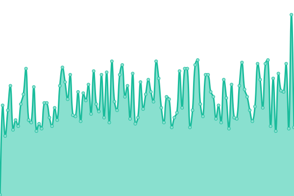
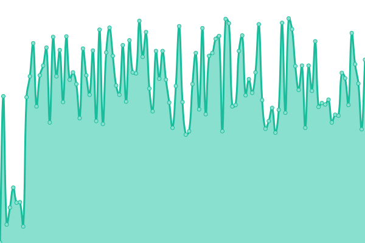
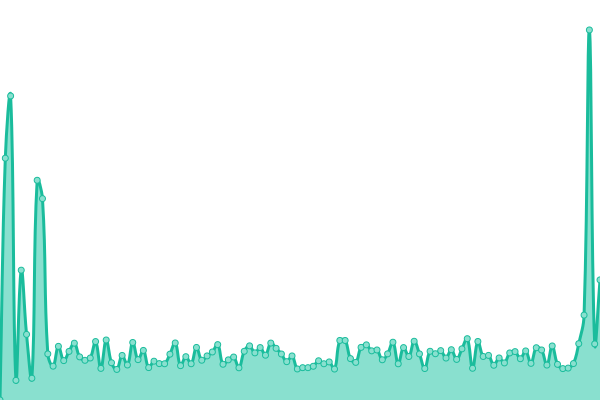
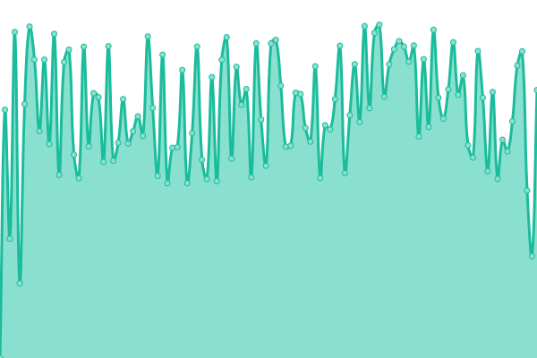
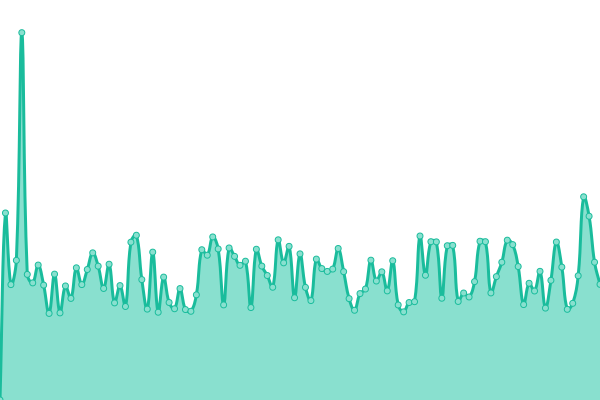
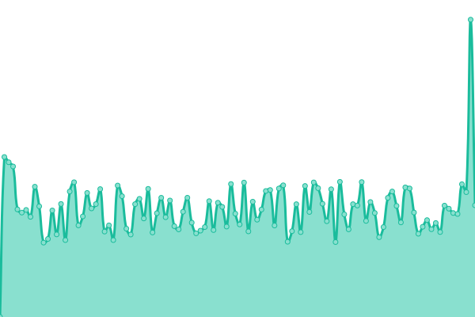

# [📈 Live Status](https://upptime.github.io/upptime): <!--live status--> **🟩 All systems operational**

This repository contains the open-source uptime monitor and status page for [Upptime](https://upptime.js.org), powered by [Upptime](https://github.com/upptime/upptime).

With [Upptime](https://upptime.js.org), you can get your own unlimited and free uptime monitor and status page, powered entirely by a GitHub repository. We use [Issues](https://github.com/upptime/upptime/issues) as incident reports, [Actions](https://github.com/upptime/upptime/actions) as uptime monitors, and [Pages](https://upptime.github.io/upptime) for the status page.

<!--start: status pages-->
<!-- This summary is generated by Upptime (https://github.com/upptime/upptime) -->
<!-- Do not edit this manually, your changes will be overwritten -->
<!-- prettier-ignore -->
| URL | Status | History | Response Time | Uptime |
| --- | ------ | ------- | ------------- | ------ |
|  [Google](https://www.google.com) | 🟩 Up | [google.yml](https://github.com/hanv89/sunupptime/commits/HEAD/history/google.yml) | 

 80ms
     
 | 

<a href="https://hanv89.github.io/sunupptime/history/google">100.00%</a>
    

|  [Wikipedia](https://en.wikipedia.org) | 🟩 Up | [wikipedia.yml](https://github.com/hanv89/sunupptime/commits/HEAD/history/wikipedia.yml) | 

 270ms
     
 | 

<a href="https://hanv89.github.io/sunupptime/history/wikipedia">100.00%</a>
    

|  [Sun Phu Quoc Airways](https://sunphuquocairways.com/) | 🟩 Up | [sun-phu-quoc-airways.yml](https://github.com/hanv89/sunupptime/commits/HEAD/history/sun-phu-quoc-airways.yml) | 

 3601ms
     
 | 

<a href="https://hanv89.github.io/sunupptime/history/sun-phu-quoc-airways">100.00%</a>
    

|  [Visit Vietnam](https://visitvietnam.asia) | 🟩 Up | [visit-vietnam.yml](https://github.com/hanv89/sunupptime/commits/HEAD/history/visit-vietnam.yml) | 

 5880ms
     
 | 

<a href="https://hanv89.github.io/sunupptime/history/visit-vietnam">100.00%</a>
    

|  [Sun Signature](https://sunsignature.vn) | 🟩 Up | [sun-signature.yml](https://github.com/hanv89/sunupptime/commits/HEAD/history/sun-signature.yml) | 

 3516ms
     
 | 

<a href="https://hanv89.github.io/sunupptime/history/sun-signature">100.00%</a>
    

|  [Booking Sun World](https://booking.sunworld.vn) | 🟩 Up | [booking-sun-world.yml](https://github.com/hanv89/sunupptime/commits/HEAD/history/booking-sun-world.yml) | 

 2918ms
     
 | 

<a href="https://hanv89.github.io/sunupptime/history/booking-sun-world">100.00%</a>
    

<!--end: status pages-->

[**Visit our status website →**](https://upptime.github.io/upptime)

## 📄 License

- Powered by: [Upptime](https://github.com/upptime/upptime)
- Code: [MIT](./LICENSE) © [Anand Chowdhary](https://anandchowdhary.com)
- Data in the `./history` directory: [Open Database License](https://opendatacommons.org/licenses/odbl/1-0/)
